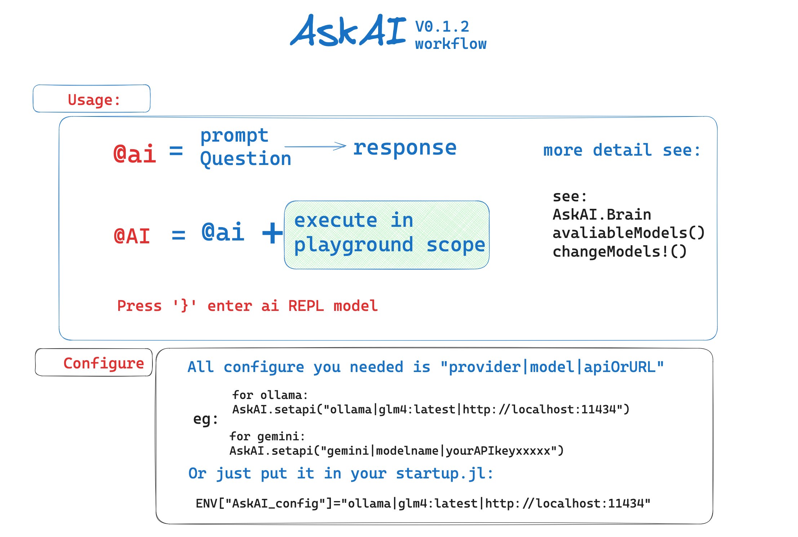
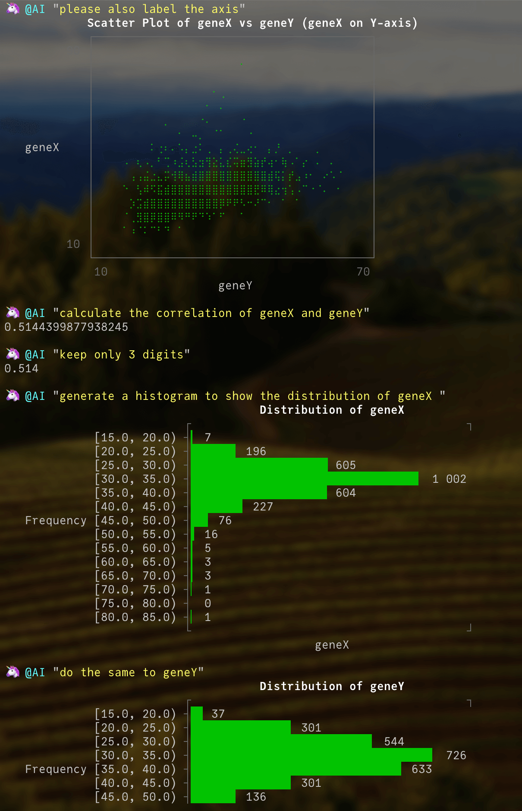
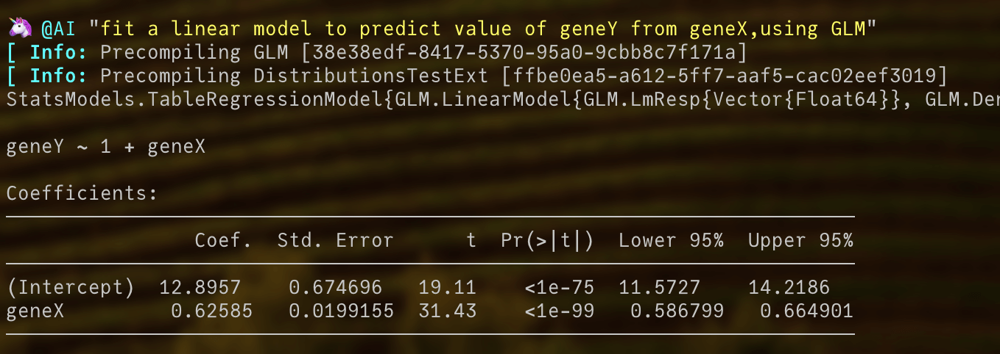
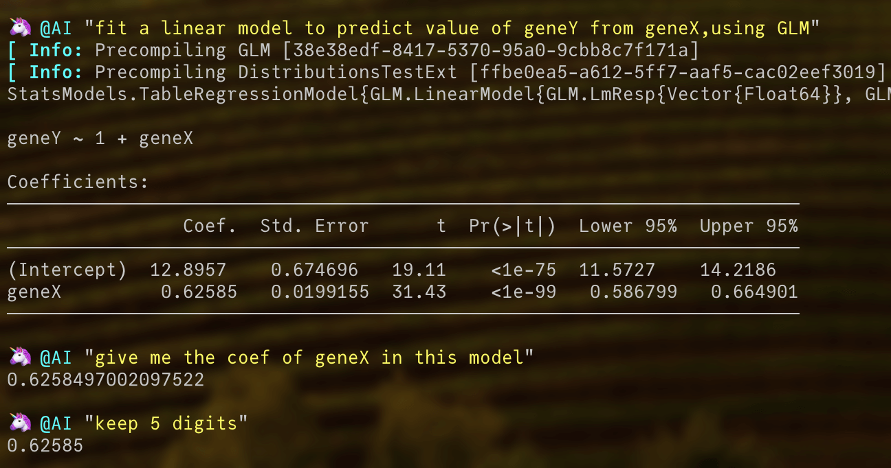

# Overview

AskAI.jl, as its name suggests, is a straightforward tool for querying Large Language Models. 
Currently supporting only Google's Gemini model due to its free, though rate-limited, API, it's designed to be simple and direct: send prompts and questions to Gemini, and optionally execute the included code within a sandboxed "playground" to avoid affecting the main scope.

The main macro, `@ai`, retrieves results from a large language model (current the Gemini, more model supported soon), while `@AI` executes the code within the "playground" scope and displays the output(or any errors.)

a REPL mode was also support. Press `}` to enter and backspace to exit





!!! note
    as most of the AI tool, it needs the api key, for the Gemini key you can apply from Google Gemini. and the set it in the `ENV["AI_API_KEY"]` or use `AskAI.setapi()` to replace new key. please also add a module called playground: `module playground end` in your main scope for the code execute. 

!!! note
    A convenient way is to put below code in your Julia `startup.jl` configuration file.
    ```
    ENV["AI_API_KEY"] = "your_key_for_Google_Gemini"
    module playground end
    using AskAI
    ```
    then you can use the AskAI in every session by default


it starts as my persional AI tool in julia REP and only support the Gemini model currently. have fun with it and I welcome your suggestions and input for AskAI.jl!!!

# quickly example
Here's an example of using AskAI to generate scatter and histogram plots and perform basic statistical calculations.
```julia 
@AI "tell me the current date, use the pacakge when in need"
@AI "create a new project in /tmp, name it as demo + date, activate it"
@AI "load my data as df, the data file is in /tmp/celldata.csv"
@AI "tell me the data size"
@AI "does the data contain columns named geneX and  geneY??"
@AI "install the package to support figure display in the terminal"
@AI "plot a scatter plot of geneX and geneY, I want the geneX on axis Y"
@AI "please also label the axis"
@AI "calculate the correlation of geneX and geneY"
@AI "keep only 3 digits"
@AI "generate a histogram to show the distribution of geneX "
@AI "do the same to geneY"
@AI "fit a linear model to predict value of geneY from geneX,using GLM"
@AI "give me the coef of geneX in this model,keep 5 digits"
```


## Output Results are here 

!!! details 
    
    
    


!!! note
    some time you may get the wrong result from the LLM, LLM results aren't always perfect, so please double-check. You can use `@ai` instead of `@AI` for code checks. then use `exe()` to perform the code. Often the case I met is the necessary packages aren't installed.
    ```julia
    @ai "tell me the current date,install the package if it needs"
    AskAI.exe(ans)
    ```

to review the conversation history
```julia
AskAI.Brain.history["ask"] 
AskAI.Brain.history["ans"] 

# review the last response 
AskAI.Brain.history["ans"][end] |> AskAI.MD
```


you can also try the stream mode under terminal
```julia
AskAI.Brain.stream = true
@ai "why the sky is blue"
```


# function and macro
```@autodocs
Modules = [AskAI]
Pages   = ["AskAI.jl", "brain.jl"]
```

