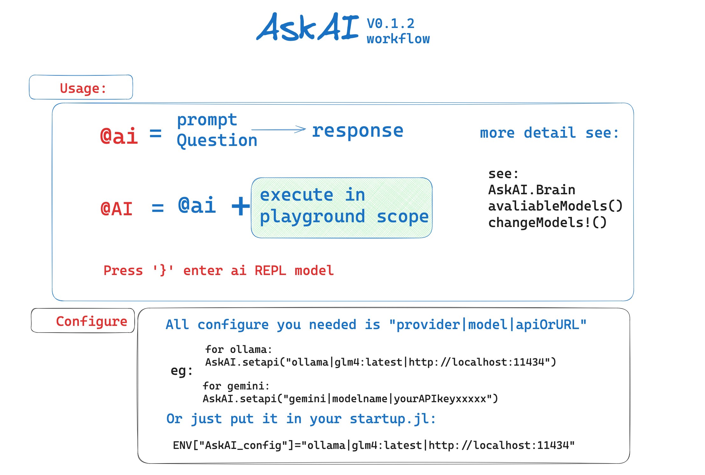

AskAI.jl, as its name suggests, is a straightforward tool for querying Large Language Models. 
Currently supporting only Google's Gemini model due to its free, though rate-limited, API, it's designed to be simple and direct: send prompts and questions to Gemini, and optionally execute the included code within a sandboxed "playground" to avoid affecting the main scope.

The main function, `askai(question, prompts)`, retrieves results from a large language model. Two macros are designed to extract Julia code from these results. `@ai` displays the code as markdown, while `@AI` executes the code within the "playground" scope and displays the output(or any errors.)

